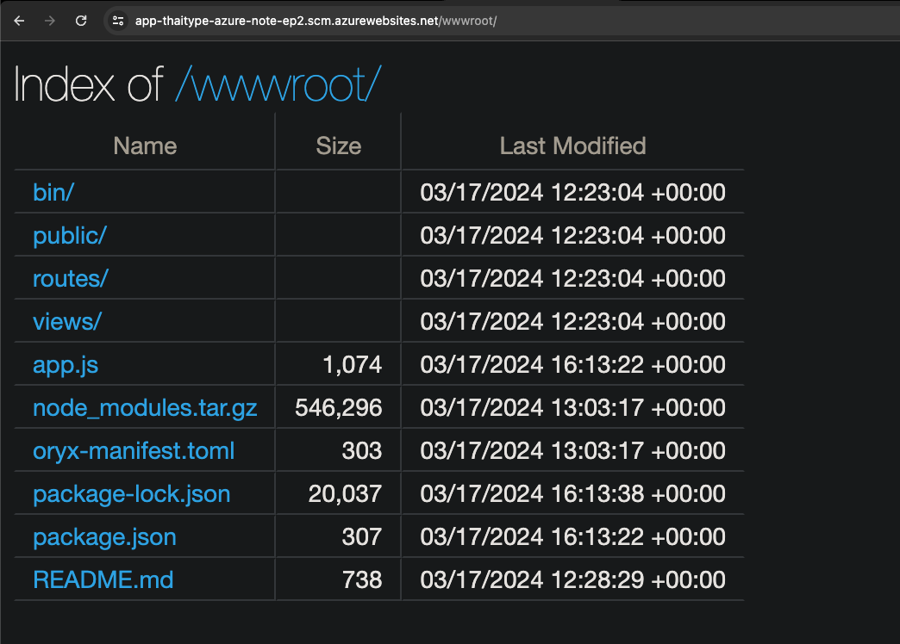

# Deploy App Service with Az CLI

https://learn.microsoft.com/en-us/azure/app-service/quickstart-nodejs?tabs=linux&pivots=development-environment-cli

## Run locally

```bash
npx express-generator 02-app-service-nodejs --view ejs
cd 02-app-service-nodejs && npm install
DEBUG=myexpressapp:* npm start
```

## Deploy 
```bash
az login
az webapp config appsettings set --resource-group rg-azure-note-ep2 --name app-thaitype-azure-note-ep2 --settings SCM_DO_BUILD_DURING_DEPLOYMENT=true
az webapp up --name app-thaitype-azure-note-ep2 --resource-group "rg-azure-note-ep2" --runtime "NODE:20-lts"
```

## Create app service and Deploy
This will create random name for the app service, with free t

```bash
az login
az webapp up --sku F1
```

## SCM_DO_BUILD_DURING_DEPLOYMENT

When you deploy an App Service using Node.js with Azure CLI (`az web app up ...`) and set the `SCM_DO_BUILD_DURING_DEPLOYMENT` setting to `true`, it triggers the Azure App Service to perform an "in-place" build on the server side. This involves executing `npm install` (or the relevant package manager command) to install dependencies based on the `package.json` file present in your project. The reason for this behavior is to ensure that your Node.js application has all the necessary dependencies installed directly on the Azure environment, matching the specific environment's configuration and OS.

The compression of the `node_modules` folder into `node_modules.tar.gz` is part of the optimization and deployment process managed by Azure App Service. This behavior is observed for a few reasons:

1. **Efficiency in Deployment:** Compressing the `node_modules` directory into a `.tar.gz` file significantly reduces the size and number of files that need to be transferred during the deployment process. This results in faster deployment times since fewer files and data need to be copied over the network.

2. **Disk Space Optimization:** By compressing the `node_modules` directory, Azure App Service optimizes the use of disk space on the server. This is particularly important for larger applications with many dependencies, as the uncompressed `node_modules` can take up significant space.

3. **Consistency and Integrity:** Having the `node_modules` compressed into a single file helps maintain the consistency and integrity of the dependencies. It ensures that the exact set of dependencies installed during the build process is used at runtime, reducing issues related to missing or mismatched packages.

4. **Performance Considerations:** In some cases, serving an application with dependencies compressed might offer performance benefits in terms of I/O operations, as the server deals with fewer files. However, the primary performance benefit lies in the deployment and disk space optimization rather than the runtime performance.

Azure App Service automatically handles the extraction of `node_modules.tar.gz` when the application starts, ensuring that your application has access to all its dependencies. This process is transparent from a user perspective, and you shouldn't need to manually intervene or extract the compressed file.

This behavior is a part of Azure's optimizations for deployment and runtime performance, and while it might seem unusual at first, it aligns with best practices for cloud-based application deployments.




Example files: `oryx-manifest.toml`

```toml
NodeVersion="20.11.1"
nodeBuildCommandsFile="/tmp/zipdeploy/extracted/oryx-build-commands.txt"
Frameworks="Express"
compressedNodeModulesFile="node_modules.tar.gz"
OperationId="52b2db98d29329e8"
SourceDirectoryInBuildContainer="/tmp/8dc468296f8427e"
PlatformName="nodejs"
CompressDestinationDir="false"
```

Ref: 

- https://github.com/projectkudu/kudu/wiki/Configurable-settings#enabledisable-build-actions